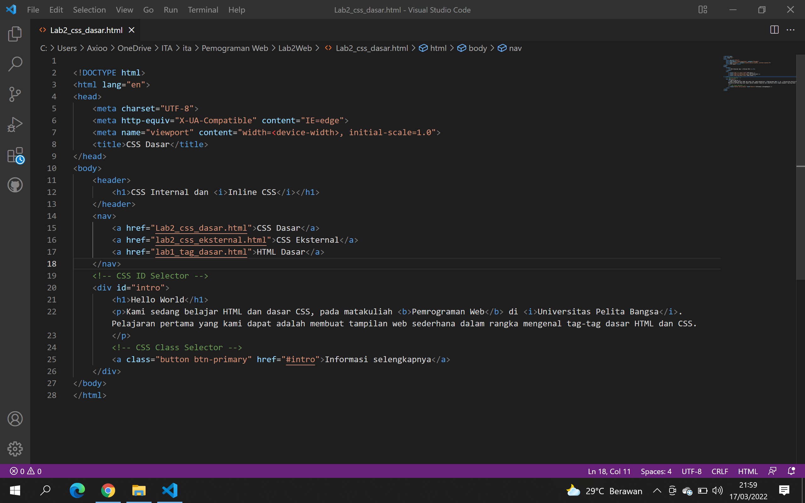
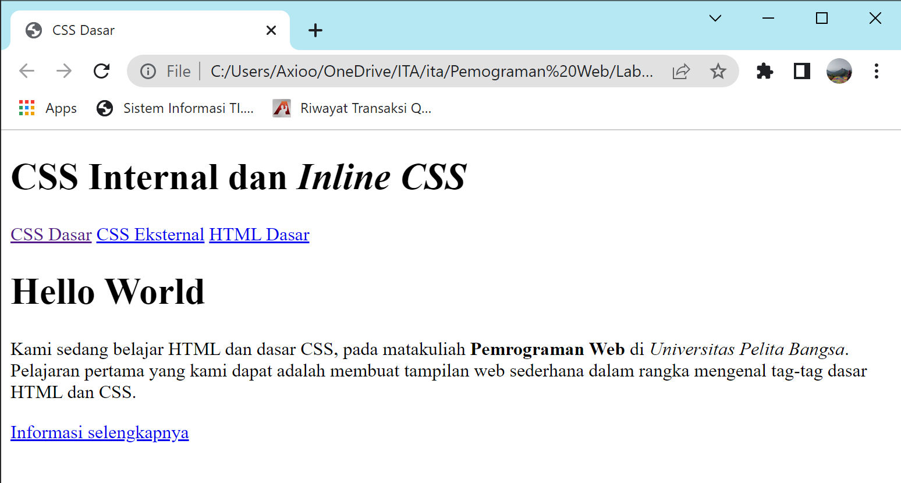
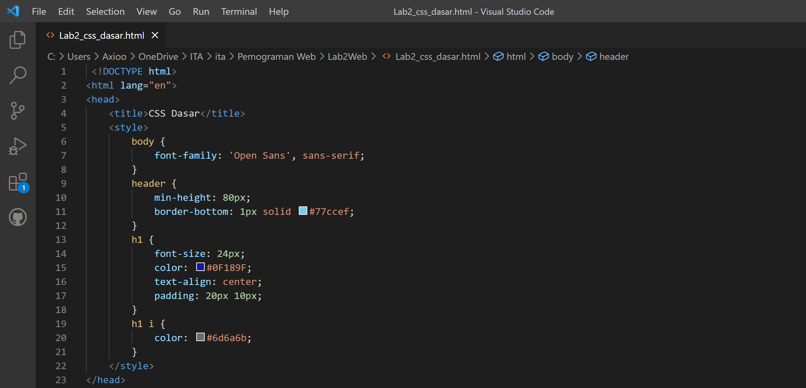
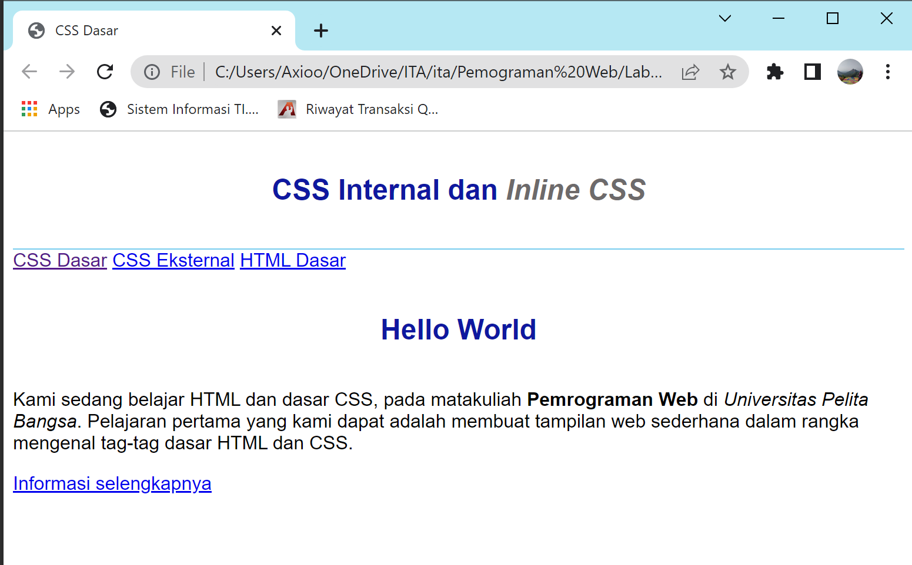
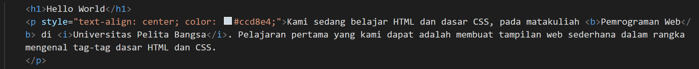
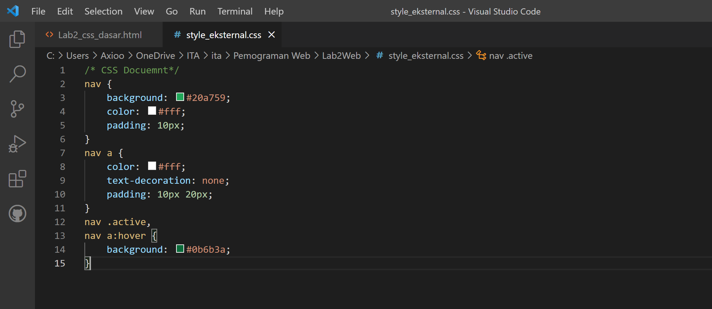
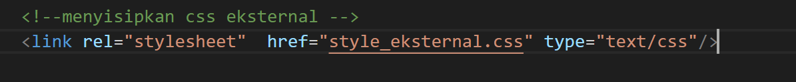
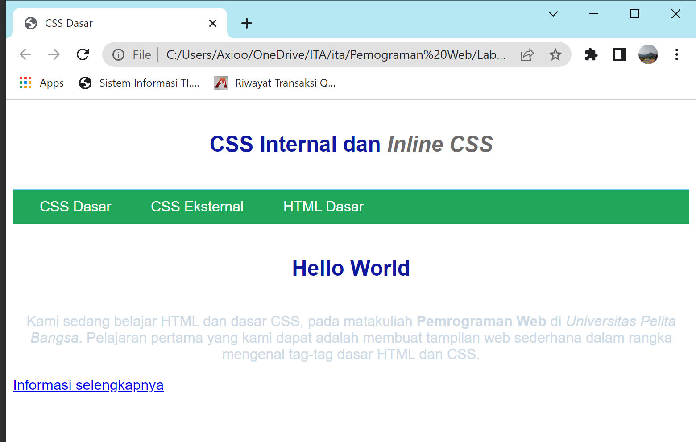
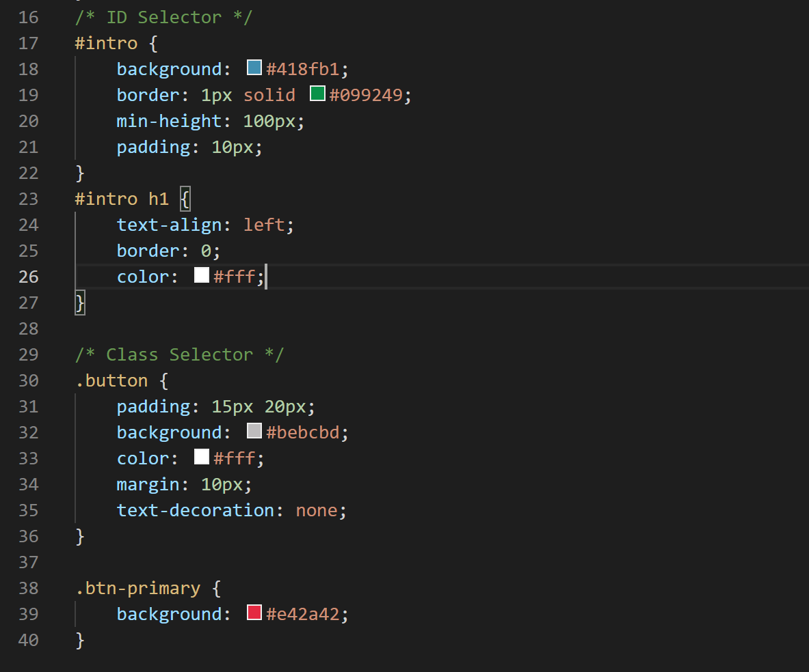
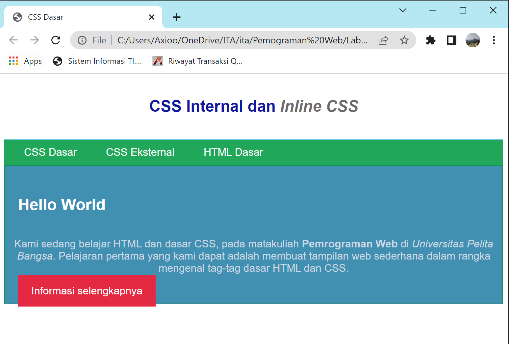

# Lab2Web
Repository ini dibuat untuk memenuhi tugas mata kuliah Pemograman Web

Nama : Miftahu Rizkiyah 
NIM  : 312010014 
Kelas : TI.20.B1 

 
Melanjutkan dari repository sebelumnya, sekarang saya akan membuat untuk langkah-langkah html & CSS
 

## 1. Membuat Dokumen HTML

 

Output yang dihasilkan  

 

## 2. Mendeklarasikan CSS Internal

 

Output yang dihasilkan  

 

## 3. Menambahkan Inline CSS

 

Output yang dihasilkan  

## 4. Membuat CSS Eksternal

 
Lalu kita tambahkan tag <Link> untuk merujuk file CSS 

Output yang dihasilkan  

 

Untuk langkah selanjutnya kita akan menambahkan CSS Selector menggunakan ID dan class selector. Pada file Style_Eksternal

 

Hasil output yang keluar adalah seperti ini.

 

----------------------------------------------------------------------------------------------------------------
Pertanyaan dan Tugas 

1. Style_eksternal.css
 

2. h1 iaalah heading yang digunakan untuk penulisan judul utama dari document. #intro h1 untuk judul isi
 

3. Deklarasi yang ditampilkan adalah internal css 

 

4. Deklarasi Pada CSS

## Thank You

