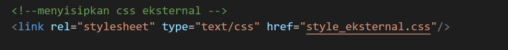

# Lab2Web
Repository ini dibuat untuk memenuhi tugas mata kuliah Pemograman Web

Nama : Miftahu Rizkiyah 
NIM  : 312010014 
Kelas : TI.20.B1 

 
Melanjutkan dari repository sebelumnya, sekarang saya akan membuat untuk langkah-langkah html & CSS
 
##1. Membuat document HTML

